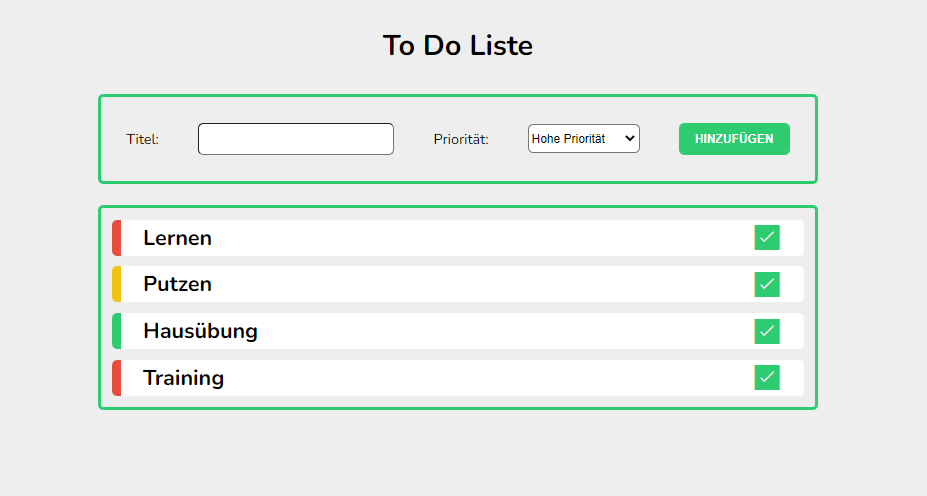

# Angular - Components, DataBinding, Events

This project was generated with [Angular CLI](https://github.com/angular/angular-cli) version 12.0.2.

## Getting Started 🚀

Run `ng serve` for a dev server. Navigate to `http://localhost:4200/`. The app will automatically reload if you change any of the source files.

## Purpose 💻
This ToDo-List app should demonstrate how components, data binding and events work in Angular.
